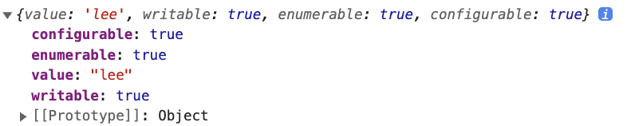
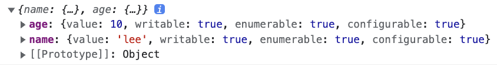

# 16장 프로퍼티 어트리뷰트

<br>
<br>
<br>

## 16-1 내부 슬롯과 내부 메서드

<br>

프로퍼티 어트리뷰트를 이해하기 위해서는 내부 슬롯과 내부 메서드를 먼저 이해하여야 한다.

ECMAScript 사양에 등장하는 이중 대괄호 ([[]])로 감싼 이름들이 내부 슬롯, 메서드이다.

이는 개발자들이 직접 접근할 수 있는 공개된 프로퍼티는 아니고, 일부에 한하여 간접적으로 접근할 수 있는 수단을 제공하기도 한다.

```
const o = {}
o.__proto__ // Object.prototype
이것도 원래는 비표준이었지만 es6에서 표준으로 바뀌었고, 현재는 없애려고 하는 추세임. 따라서 
Object.getPrototype(o) // 이거 사용을 권장함

o[[Prototype]] // 접근 불가
o.[[Prototype]] // 접근 불가
```

---

<br>
<br>
<br>

## 16-2 프로퍼티 어트리뷰트와 프로퍼티 디스크립터 객체

<br>

자바스크립트 엔진은 프로퍼티를 생성할 때 프로퍼티의 상태를 나타내는 프로퍼티 어트리뷰트를 기본값으로 자동 정의한다.

프로퍼티 어트리뷰트는 내부 슬롯([[Value]], [[Writable]], [[Enumerable]], [[Configurable]])이고, getOwnPropertyDescriptor을 통해 간접적으로는 확인이 가능하다.

```
const person = {
    name: 'lee',
    age: 20
}
Object.getOwnPropertyDescriptor(person, 'name')
```
<br>

키값 하나만 확인하고 싶다면 `Object.getOwnPropertyDescriptor(person, 'name')`,


<br>

모든 키값을 확인하고 싶다면 `Object.getOwnPropertyDescriptors(person)`


---

<br>
<br>
<br>

## 16-3 데이터 프로퍼티와 접근자 프로퍼티

<br>

프로퍼티는 데이터와 접근자로 구분할 수 있다.

|구분|설명|
|:-:|:-:|
|데이터 프로퍼티|키와 값으로 구성된 일반적인 프로퍼티|
|접근자 프로퍼티|자체적인 값은 없고 다른 데이터 프로퍼티의 값을 읽거나 저장할 때 <br> 호출되는 접근자 함수로 구성된 프로퍼티|

### 3-1 데이터 프로퍼티

|프로퍼티 어트리뷰트|프로퍼티 디스크립터 객체의 프로퍼티|설명|
|:-:|:-:|:-|
|[[Value]]|value|<li>프로퍼티 키를 통해 프로퍼티 값에 접근하면 반환되는 값</li><li>프로퍼티 키를 통해 값을 변경하면 [[Value]]에 값을 재할당한다. 이때 프로퍼티가 없으면 프로퍼티를 동적으로 생성하고 생성된 프로퍼티의 [[Value]]에 값을 저장한다.</li>|
|[[Writable]]|writable|<li>프로퍼티 값의 변경 가능 여부를 나타내며 boolean값을 갖는다.</li><li>[[Writable]]의 값이 false인 경우 해당 프로퍼티의 [[Value]]의 값을 변경할 수 없는 읽기 전용 프로퍼티가 된다.</li>|
|[[Enumerable]]|enumerable|<li>프로퍼티의 열거 가능 여부를 나타내며 boolean값을 갖는다.</li><li>[[Enumerable]]의 값이 false인 경우 해당 프로퍼티는 for...in문이나 Object.keys메서드 등으로 열거할 수 없다.</li>|
|[[Configurable]]|configurable|<li>프로퍼티의 재정의 가능 여부를 나타내며 boolean값을 갖는다.</li><li>[[Configurable]]의 값이 false인 경우 해당 프로퍼티의 삭제, 프로퍼티 어트리뷰트 값의 변경이 금지된다. 단, [[Writable]]이 true인 경우 [[Value]]의 변경과 [[Writable]]을 false로 변경하는 것은 허용된다.</li>|

### 3-2 접근자 프로퍼티

|프로퍼티 어트리뷰트|프로퍼티 디스크럽터 객체의 프로퍼티|설명|
|:-:|:-:|:-|
|[[Get]]|get|접근자 프로퍼티를 통해 데이터 프로퍼티의 값을 읽을 때 호출되는 접근자 함수다. 즉, 접근자 프로퍼티 키로 프로퍼티 값에 접근하면 프로퍼티 어트리뷰트 [[Get]]의 값, 즉 getter함수가 호출되고 그 결과가 프로퍼티 값으로 반환된다.|
|[[Set]]|set|접근자 프로퍼티를 통해 데이터 프로퍼티의 값을 저장할 때 호출되는 접근자 함수다. 즉, 접근자 프로퍼티 키로 프로퍼티 값을 저장하면 프로퍼티 어트리뷰트 [[Set]]의 값, setter함수가 호출되고 그 결과가 프로퍼티 값으로 저장된다.|
|[[Enumerable]]|enumerable|데이터 프로퍼티의 [[Enumerable]]와 같다.|
|[[Configurable]]|configurable|데이터 프로퍼티의 [[Configurable]]와 같다.|

```
const person = {
    firstname: 'hyungwon',
    lastname: 'jang',

    get fullname() {
        return `${this.firstname} `${this.lastname}`;
    }

    set fullname(name) {
        [this.firstname, this.lastname] = name.split(' ')
    }
}
```


---

<br>
<br>
<br>

## 16-4 프로퍼티 정의

<br>

Object.defineProperty메서드를 사용하면 프로퍼티의 어트리뷰트를 정의할 수 있다. 인수로는 객체의 참조와 데이터 프로퍼티의 키인 문자열, 프로퍼티 디스크립터 객체를 전달한다.

```
const person = {}

Object.defineProperty(person, 'firstname', {
    value: 'hyungwon',
    writable: true,
    enumerable: true,
    configurable: true
})

Object.defineProperty(person, 'fullname', {
    set() {
        return //
    },
    get() {
        return //
    },
    enumerable: true,
    configurable: true
})
```

* Object.defineProperty는 한 번에 하나 씩만 정의할 수 있지만 Object.defineProperties를 사용하면 한 번에 여러 개를 정의할 수 있다.

---

<br>
<br>
<br>

## 16-5 객체 변경 방지

<br>

|구분|메서드|프로퍼티 추가|프로퍼티 삭제|프로퍼티 값 읽기|프로퍼티 값 쓰기|프로퍼티 어트리뷰트 재정의|
|-|-|-|-|-|-|-|
|객체 확장 금지|Object.preventExtensions|X|O|O|O|O|
|객체 밀봉|Object.seal|X|X|O|O|X|
|객체 동결|Object.freeze|X|X|O|X|X|

1. 객체 확장 금지
* 확장이 가능한 지 여부는 Object.isExtensible(객체이름)으로 확인 가능하다.

<br>

2. 객체 밀봉
* 밀봉된 여부는 Object.isSealed(객체이름)으로 확인 가능하다.

<br>

3. 객체 동결
* 동결된 여부는 Object.isFrozen(객체이름)으로 확인 가능하다.

<br>

4. 불변 객체
* 지금까지는 얕은 변경 방지로 직속 프로퍼티만 변경이 방지되고 중첩 객체까지는 영향을 주지 못한다. 따라서 Object.freeze 메서드로 객체를 동결하여도 중첩 객체까지는 동결할 수 없다.
중첩 객체까지 동결하기 위해서는 객체를 값으로 갖는 모든 프로퍼티에 대해 재귀적으로 Object.freeze 메서드를 호출해야 한다.

---

<br>
<br>
<br>
