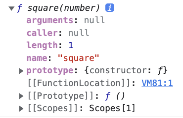

# 18장 함수와 일급 객체
<br>
<br>
<br>

## 18-1 일급 객체

<br>

* 무명의 리터럴로 생성할 수 있다. 즉, 런타임에 생성이 가능하다.
* 변수나 자료구조(객체, 배열 등)에 저장할 수 있다.
* 함수의 매개변수에 전달할 수 있다.
* 함수의 반환값으로 사용할 수 있다.

일급 객체는 상위의 조건을 만족하는 객체이다. 또한, 자바스크립트의 함수는 상위 모든 조건을 만족하기에 일급 객체라고 할 수 있다.

함수가 일급 객체라는 것은 그 두 가지를 동일시 할 수 있다는 것이며 함수는 값을 사용할 수 있는 곳이라면 어디든지 리터럴로 정의할 수 있고, 런타임에 함수 객체로 평가된다.

함수와 일반 객체와의 차이점이라면 일반 객체는 호출(실행)할 수 없지만 함수 객체는 호출(실행)할 수 있다. 그리고 함수 객체는 고유 프로퍼티를 소유한다.

---

<br>
<br>
<br>

## 18-2 함수 객체의 프로퍼티

<br>

함수도 객체이기에 프로퍼티를 가질 수 있다.

```
function square(number) {
    return number * number
}

console.dir(square)
```



이처럼 arguments, caller 등은 모두 함수 객체의 고유의 데이터 프로퍼티이다.

<br>


### 2-1 arguments 프로퍼티

1. 함수 호출 시 전달된 인수들의 정보를 담고 있는 순회 가능한 유사 배열 객체이며 함수 내부에서 지역 변수처럼 사용되고, 즉 외부에서는 참조할 수는 없다.

2. 함수 객체의 arguments 프로퍼티는 ES3 기준으로 사라졌고, 따라서 Function.arguments가 아닌, 함수 내부에서 지역 변수처럼 사용할 수 있는 arguments객체를 참조하여야 한다.

3. 인수 개수는 초과되어도 자바스크립트에서는 에러를 띄우지 않고, 전달받은 인수들은 모두 arguments 객체 안에 저장된다.

4. 매개변수 개수를 확정할 수 없는 가변 인자 함수를 구현할 때 유용하다.

### 2-2 caller 프로퍼티

caller 프로퍼티는 ECMAScript 사양에는 포함되지 않은 비표준 프로퍼티이며 표준화 될 일도 없으므로 그냥 이런 게 있다고만 알고 넘어가자 쓸 일도 없을 듯 하다.

### 2-3 length 프로퍼티

length프로퍼티는 함수를 정의할 때 선언한 매개변수의 개수를 가리킨다.

* arguments 객체의 length 프로퍼티와 함수 객체의 length 프로퍼티 값은 다를 수 있다.
arguments는 인자의 개수를 가리키고, 함수 객체는 매개변수의 개수를 가리킨다.

### 2-4 name 프로퍼티

name 프로퍼티는 ES6에 들어서야 표준화 된 프로퍼티이다. 따라서 ES5에서와 ES6에서 다르게 동작하므로 주의해야 한다.

익명 함수의 경우 ES5에서는 빈 문자열을 값으로 갖지만, ES6에서는 함수 객체를 가리키는 식별자를 값으로 갖는다.

### 2-5 __proto__접근자 프로퍼티

모든 객체는 [[Prototype]]이라는 내부 슬롯을 갖고, 이에 대해서는 추후 알아보도록 하자.

__proto__프로퍼티는 그 내부 슬롯이 가리키는 프로토타입 객체에 간접적으로나마 접근하기 위해 사용하는 접근자 프로퍼티이다.

```
const obj = {a:1}
console.log(obj.__proto__ === Object.prototype) // true
```

### 2-6 prototype 프로퍼티

prototype 프로퍼티는 생성자 함수로 호출할 수 있는 함수 객체, 즉 constructor만이 소유하는 프로퍼티이다. 일반 객체와 생성자 함수로 호출할 수 없는 non-constructor에는 prototype 프로퍼티가 없다.

prototype 프로퍼티는 함수가 객체를 생성하는 생성자 함수로 호출될 때 생성자 함수가 생성할 인스턴스의 프로토타입 객체를 가리킨다.


---