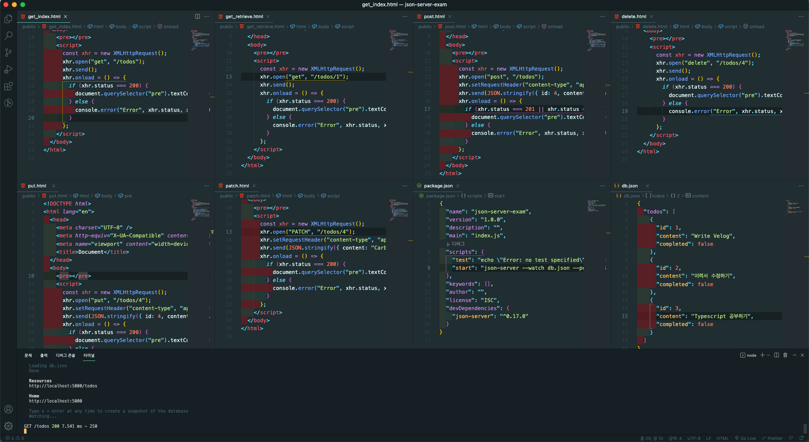
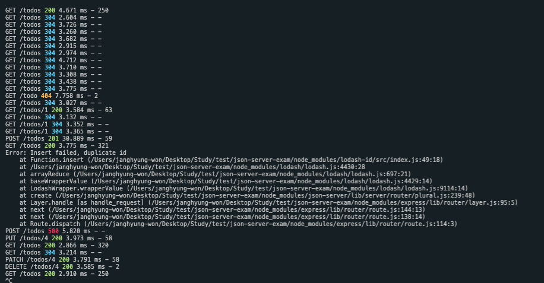

# 44장 목차 REST API

 
 
 

## 44-1 REST API의 구성

 

| 구성 요소 | 내용                           | 표현 방법        |
| --------- | ------------------------------ | ---------------- |
| 자원      | 자원                           | URI(엔드포인트)  |
| 행위      | 자원에 대한 행위               | HTTP 요청 메서드 |
| 표현      | 자원에 대한 행위의 구체적 내용 | 페이로드         |

---

 
 
 

## 44-2 REST API 설계 원칙

 

1. URI는 리소스를 표현해야 한다.
2. 리소스에 대한 행위는 HTTP 요청 메서드로 표현한다.

| HTTP 요청 메서드 | 종류             | 목적                    | 페이로드 |
| ---------------- | ---------------- | ----------------------- | -------- |
| GET              | index / retrieve | 모든 / 특정 리소스 취득 | X        |
| POST             | create           | 리소스 생성             | O        |
| PUT              | replace          | 리소스의 전체 교체      | O        |
| PATCH            | modify           | 리소스의 일부 수정      | O        |
| DELETE           | delete           | 모든/특정 리소스 삭제   | X        |

---

 
 
 

## 44-3 JSON Server를 이용한 REST API 실습

 

 

### 3-1 JSON Server 설치

### 3-2 db.json 파일 생성

### 3-3 JSON Server 실행

### 3-4 GET 요청

### 3-5 POST 요청

### 3-6 PUT 요청

### 3-7 PATCH 요청

### 3-8 DELETE 요청

---

 
 
 
