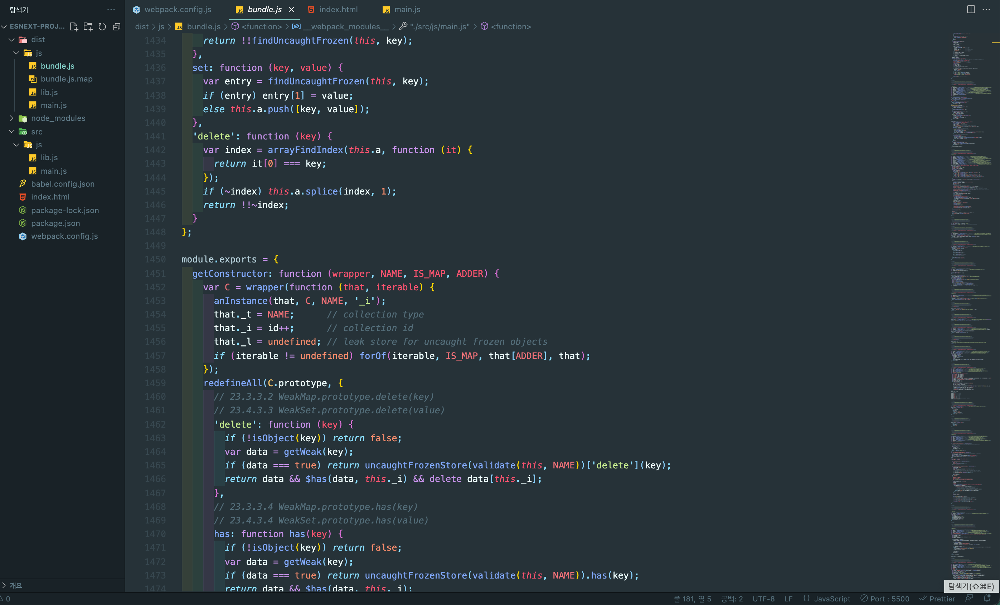

# 49장 모듈

IE를 제외한 대부분의 브라우저는 ES6를 지원한다(IE는 11%). 따라서 브라우저별 지원 환경을 구축해야 하고, 대부분의 프로젝트가 모듈을 사용하므로 모듈 로더가 필요하다. ES6 모듈(ESM)도 있지만, 다음의 이유 때문에 아직은 별도의 모듈 로더를 사용하는 것이 일반적이다.

- 구형 브라우저는 ESM을 지원하지 않음
- 사용하더라도 트랜스파일링이나 번들링이 필요한 것은 변함 없음
- ESM이 아직 지원하지 않는 기능이 있고, 이슈가 있음.

 
 
 

## 49-1 Babel

 

### 1-1 Babel 설치

### 1-2 Babel 프리셋 설치와 babel.config.json 설정 파일 작성

Babel이 제공하는 공식 Babel 프리셋은 다음과 같다.

- @babel/preset-env
- @babel/preset-flow
- @babel/preset-react
- @babel/preset-typescript

### 1-3 트랜스 파일링

### 1-4 Babel 플러그인 설치

### 1-5 브라우저에서 모듈 로딩 테스트

---

 
 
 

## 49-2 Webpack

 

### 2-1 Webpack 설치

### 2-2 babel-loader 설치

### 2-3 webpack.config.js 설정 파일 작성

### 2-4 babel-polyfill 설치

---

 
 
 
